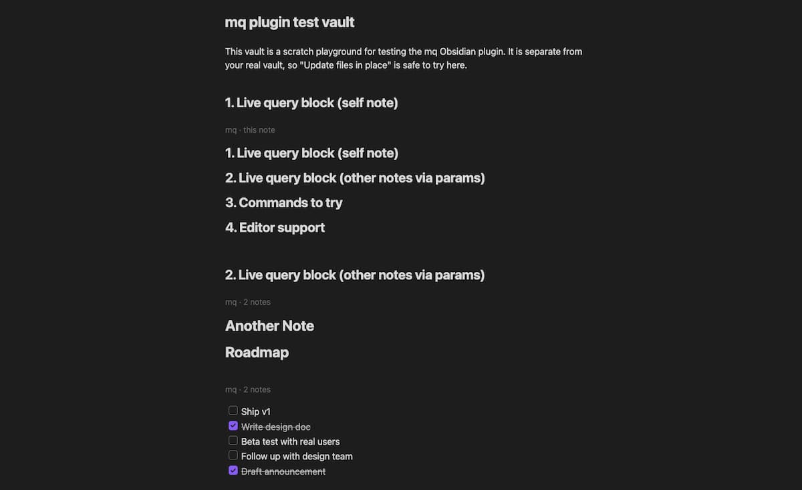

<h1 align="center">mq for Obsidian</h1>

Run [mq](https://github.com/harehare/mq) (a jq-like query language for Markdown) queries directly inside [Obsidian](https://obsidian.md), fully client-side via WebAssembly — no network access required.



## Features

### Live query blocks

Add a ` ```mq ` code block to a note and it renders the query's result inline, right below the block. By default it queries the note it lives in:

````markdown
```mq
.h1
```
````

You can point a block at other notes instead of the current one, using params after `mq` on the fence line:

````markdown
```mq file="Projects/Roadmap.md, [[Another Note]]"
.todo
```

```mq folder="Projects" tag="#active"
.h1
```

```mq dataview="LIST FROM #project"
.[]
```
````

| Param       | Selects                                                                 |
| ----------- | ------------------------------------------------------------------------ |
| `file=`     | Comma-separated notes, by path, name, or `[[wikilink]]`                  |
| `folder=`   | Comma-separated folders (recursive)                                      |
| `tag=`      | Comma-separated tags, with or without `#`                                |
| `dataview=` | A [Dataview](https://github.com/blacksmithgu/obsidian-dataview) DQL query, rendered to Markdown and used as input (requires the Dataview plugin, toggle in settings) |

`file`/`folder`/`tag` can be combined; their matches are unioned. Blocks re-render automatically when the note(s) they query change (toggle in settings).

### Run mq query on current note

Command palette → **mq: Run mq query on current note**. Enter a query, choose whether it applies to the whole note or just the selection, and whether the result replaces the scope, is inserted below it, or is copied to the clipboard.

Example: select some text and run `upcase()` with action "Replace" to uppercase it in place. Or run `.h1` on the whole note with action "Replace" to reduce the note down to just its top-level headings.

### Run mq query across the vault

Command palette → **mq: Run mq query across the vault**. Scope the query to a folder and/or tag (or leave both empty for the whole vault), then either:

- **Report to a new note** (default, non-destructive) — collects each note's result into a new report note.
- **Update files in place** — overwrites each matching note with its query result. This asks for confirmation and shows how many notes will be affected before it touches anything.

Example: folder `Projects`, query `.todo`, action "Report to a new note" — collects every open task across the `Projects` folder into one note.

### Editor support

Inside ` ```mq ` code blocks, in both Source mode and Live Preview, using the same query language as everywhere else in this plugin (see [Example queries](#example-queries) below):

- Syntax highlighting
- Diagnostics (parse and type errors) as you type
- Hover for function/variable signatures and docs
- Autocomplete for functions and variables defined earlier in the block

## Example queries

mq queries a note as a tree of Markdown nodes; a query is typically a **selector** (picks nodes) optionally piped into **functions** (transform or filter what was picked). The full language is documented in the [mq book](https://mqlang.org/book/); a few selectors and functions that are especially useful on Obsidian notes:

| Query | Result |
| --- | --- |
| `.h1` … `.h6`, `.h` | Headings at a specific level, or any level |
| `.task`, `.todo`, `.done` | All task list items, only unchecked, only checked |
| `.link`, `.wikilink`, `.image` | Markdown links, `[[wikilinks]]`, images |
| `.code`, `.code_inline` | Fenced code blocks, inline code spans |
| `.[]` | List items (ordered or unordered) |
| `.text`, `.p` | Paragraphs |
| `.h1 \| upcase()` | Top-level headings, uppercased |
| `.[] \| select(test(to_text(), "^TODO"))` | List items whose text starts with `TODO` |
| `.link \| .url` | The URL of every link |

Tasks are matched with the `.task`/`.todo`/`.done` selectors above, not a function — `select(is_task())` looks plausible but isn't real mq syntax and will error with `"is_task" is not defined`.

## Data access

- **Vault read** — "Run mq query across the vault" reads note contents via Obsidian's `getMarkdownFiles()` API to build its input; it never reads non-Markdown files. Nothing leaves the device — mq runs fully client-side via WebAssembly (see above).
- **Clipboard write** — the "Copy to clipboard" result action for the current-note command writes the query result via `navigator.clipboard.writeText()`. The plugin never reads the clipboard.

## Settings

- Markdown rendering style for query results (list marker, link title/URL style)
- Query timeout
- Allowed domains for `import`/`include "https://..."` (GitHub/HTTPS modules; see Limitations below)
- Auto-refresh for query blocks
- Editor support toggle
- Dataview integration toggle

## Installation

Not yet on the Community Plugins list. Until then, install manually:

1. Download `main.js`, `manifest.json`, and `styles.css` from a [release](https://github.com/harehare/obsidian-mq/releases).
2. Copy them into `<your vault>/.obsidian/plugins/mq/`.
3. Reload Obsidian and enable **mq** under Settings → Community plugins.

## Development

The wasm bindings come from the published [`mq-web`](https://www.npmjs.com/package/mq-web) npm package (a regular dependency), so building this plugin needs only Node/pnpm — no Rust toolchain.

```sh
pnpm install
pnpm run dev      # watch build, outputs main.js
```

Symlink (or copy) this directory into `<your vault>/.obsidian/plugins/mq/` to test changes live; reload Obsidian (or use the "Hot Reload" community plugin) after each rebuild.

```sh
pnpm run build   # production build
pnpm run test    # unit tests
pnpm run lint    # oxlint
```

## License

MIT
